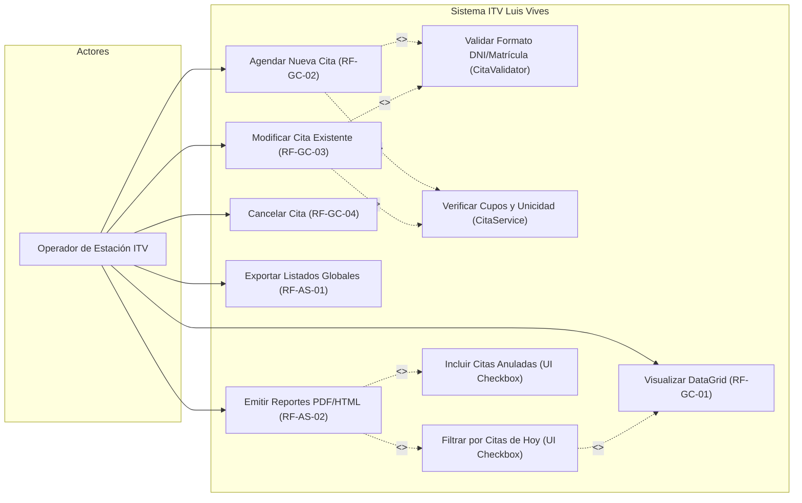
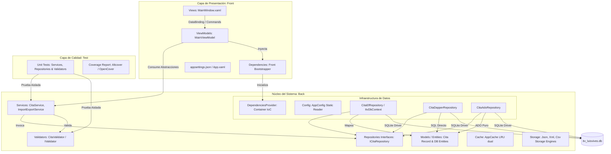
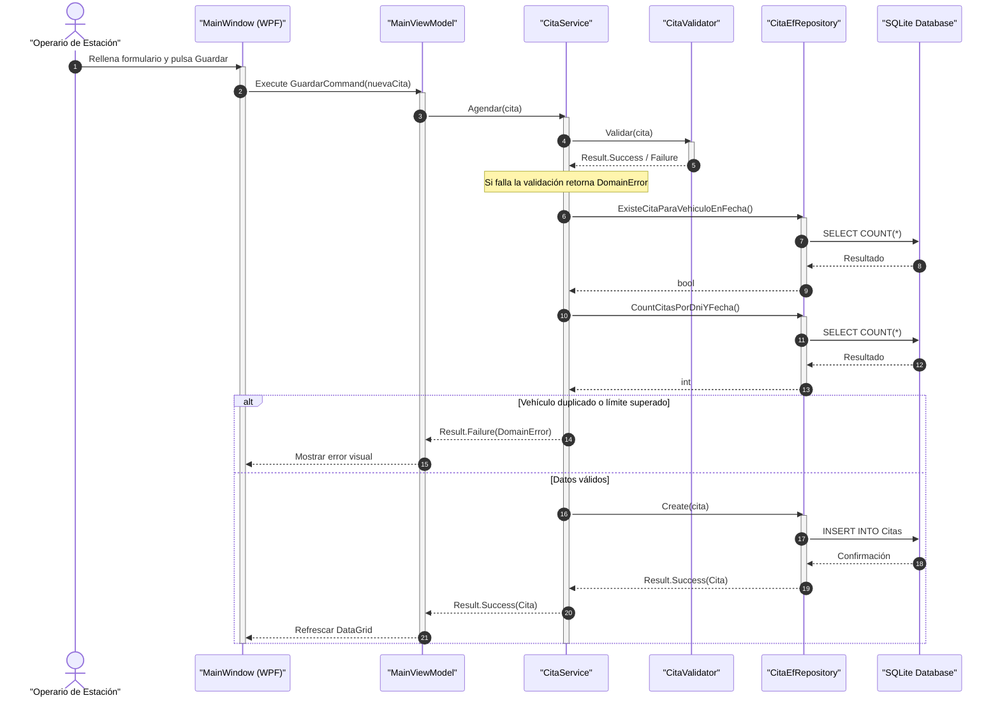
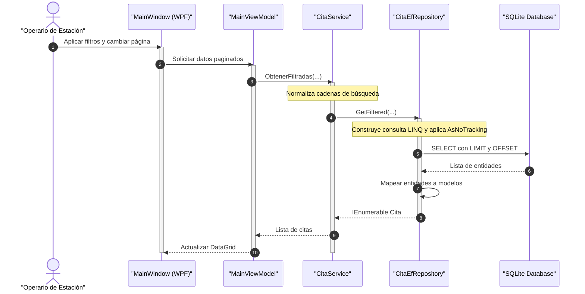
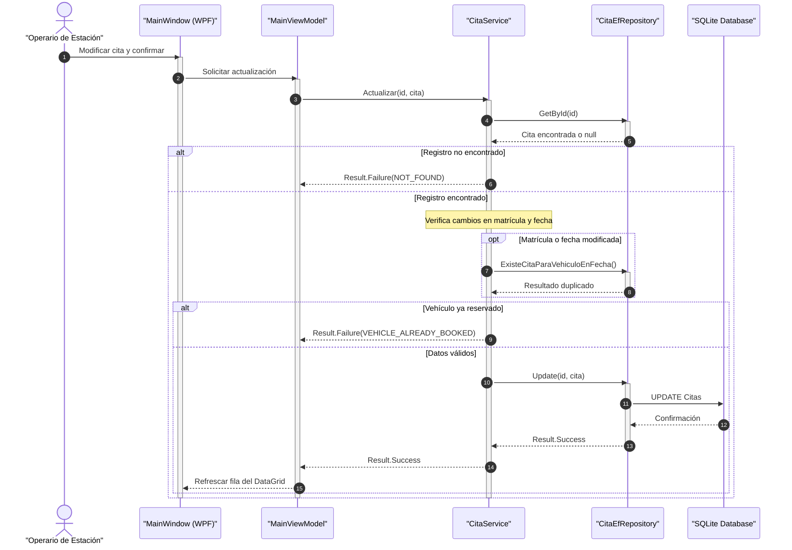
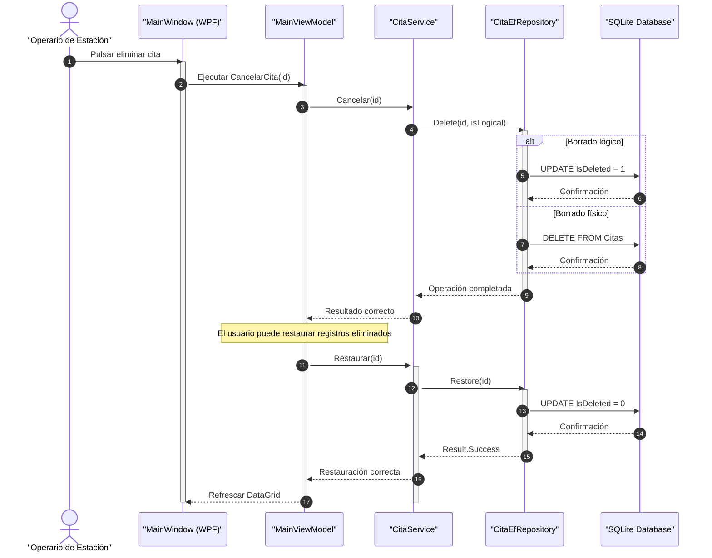
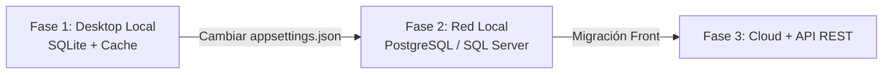

# 📑 Documentación Técnica y de Arquitectura - ITV Luis Vives

Este documento constituye la especificación de ingeniería y el manual de arquitectura del sistema de gestión de inspecciones técnicas para la estación **ITV Luis Vives**. El ecosistema está diseñado bajo principios de arquitectura limpia, inmutabilidad de datos y desarrollo tolerante a fallos.

### Menú de Navegación

- [1. Descripción del Problema y Contexto](#1-descripción-del-problema-y-contexto)
- [2. Requisitos del Sistema](#2-requisitos-del-sistema)
  - [2.1 Requisitos Funcionales](#21-requisitos-funcionales-rf)
  - [2.2 Requisitos No Funcionales](#22-requisitos-no-funcionales-rnf)
  - [2.3 Requisitos de Información](#23-requisitos-de-información)
- [3. Diagrama de Casos de Uso](#3-diagrama-de-casos-de-uso)
- [4. Diagrama de Arquitectura Detallado](#4-diagrama-de-arquitectura-detallado)
- [5. Diseño de la Base de Datos](#5-diseño-de-la-base-de-datos)
- [6. Diagramas de Secuencia para Operaciones CRUD](#6-diagramas-de-secuencia-para-operaciones-crud)
  - [6.1 Operación CREATE](#61-operación-create-agendar-nueva-cita)
  - [6.2 Operación READ](#62-operación-read-filtrado-y-paginación)
  - [6.3 Operación UPDATE](#63-operación-update-modificar-cita)
  - [6.4 Operación DELETE / RESTORE](#64-operación-delete--restore)
- [7. Análisis Económico y Planificación](#7-análisis-económico-y-planificación)
  - [7.1 Estimación de Costes de Desarrollo](#71-estimación-de-costes-de-desarrollo)
  - [7.2 Escalabilidad y Expansión](#72-escalabilidad-y-expansión)
    - [Fase 1: Aplicación Desktop Local](#️-fase-1-aplicación-desktop-local)
    - [Fase 2: Base de Datos Centralizada LAN](#-fase-2-migración-a-base-de-datos-centralizada-lan-postgresql--sql-server)
    - [Fase 3: Cloud y Aplicación Móvil](#️-fase-3-cloud-y-aplicación-móvil)

## 1. Descripción del Problema y Contexto

La estación de inspección técnica de vehículos ITV "Luis Vives" requiere automatizar la gestión integral de sus flujos operativos diarios. El software debe garantizar un control riguroso de citas, erradicar los fallos humanos comunes en la introducción de datos oficiales y mitigar la saturación de los servidores de almacenamiento relacional mediante técnicas avanzadas de optimización local.

### 🔍 Desafíos Técnicos Resueltos
* **Persistencia Polimórfica Dinámica:** Capacidad de alternar el motor de datos (*Entity Framework Core, Dapper o ADO.NET puro*) modificando exclusivamente una línea del archivo de configuración global, compartiendo una misma interfaz de repositorio.
* **Procesamiento Tolerante a Fallos:** Erradicación del uso ineficiente de excepciones para el control del flujo ordinario mediante la implementación del patrón functional `Result<T, DomainError>`.
* **Protección Contra la Latencia (Dual LRU Cache):** Desacoplamiento del acceso constante a la base de datos SQLite mediante el uso de dos cachés con política de evacuación por desuso (*Least Recently Used*), indexando de forma independiente por identificador y por matrícula.
* **Validación Multicapa Estricta:** Comprobación algorítmica automatizada de los identificadores oficiales del Ministerio del Interior y la DGT antes de permitir cualquier operación de persistencia.

---

## 2. Requisitos del Sistema

### 2.1. Requisitos Funcionales (RF)

Los requisitos funcionales se organizan de forma atómica siguiendo el comportamiento real de los servicios y validadores expuestos en el backend del sistema:

#### 🔹 Gestión y Ciclo de Vida de Citas (CRUD)
* **RF-GC-01 (Lectura Filtrada y Paginada):** El sistema permitirá listar las citas aplicando de forma combinable filtros de DNI, Matrícula, Estado (`Pendiente`, `Apta`, `No Apta`) y rangos temporales cerrados (`fechaDesde` hasta `fechaHasta`). Los resultados se entregarán paginados desde el servidor (bloques de 10 registros de forma nativa).
* **RF-GC-02 (Creación Atómica):** Registro de nuevas inspecciones técnicas calculando de forma automática los metadatos de auditoría (`CreatedAt`, `UpdatedAt`) e inicializando el estado por defecto en `Pendiente`.
* **RF-GC-03 (Modificación Integra):** Actualización selectiva de campos operativos (`Dni`, `VehiculoMatricula`, `FechaInspeccion`, `Estado`, `Observaciones`). Cada edición recalcula y actualiza de forma automática el campo `UpdatedAt`.
* **RF-GC-04 (Baja Lógica y Física Parametrizada):** Permite la eliminación de una cita. Si la directiva de configuración `UseLogicalDelete` está activa, el registro se mantiene en base de datos alterando su estado a `IsDeleted = true` e incluyendo un sello temporal en `DeletedAt`. En caso contrario, se ejecuta un borrado físico irreversible (`DELETE`).
* **RF-GC-05 (Restauración de Registros):** Permite revertir una baja lógica, reincorporando la cita al listado ordinario mediante la conmutación del flag `IsDeleted = false` y la limpieza del campo `DeletedAt`.

#### 🔹 Reglas de Negocio Operativas
* **RF-RN-01 (Algoritmo de Control de DNI):** Validación obligatoria de NIF/NIE mediante expresión regular de 8 dígitos y 1 letra, correlacionando el dígito verificador mediante el cálculo oficial de división por módulo 23 (`TRWAGMYFPDXBNJZSQVHLCKE`).
* **RF-RN-02 (Formato Oficial de Matrícula):** Restricción estricta de formato en base al patrón actual de la DGT (4 números seguidos de 3 letras consonantes), bloqueando caracteres especiales, espacios intermedios o guiones de forma previa a la validación de negocio.
* **RF-RN-03 (Ventana Temporal de Reserva):** Bloqueo de citas cuya fecha de inspección programada se encuentre fuera del rango permitido: comprendido estrictamente entre el día actual (`DateTime.Today`) y un plazo máximo de 30 días naturales en el futuro.
* **RF-RN-04 (Unicidad de Vehículo por Jornada):** Un vehículo (matrícula) no podrá agendar más de una única cita de inspección técnica dentro del mismo día natural.
* **RF-RN-05 (Límite de Acaparamiento de Cupos por Propietario):** Un único conductor o propietario (identificado por su DNI) no podrá acaparar más de tres (3) vehículos en la misma fecha asignada dentro de la estación.
* **RF-RN-06 (Acotación de Descripciones):** Restricción de longitud para el campo de observaciones técnicas del operario, limitando su capacidad a un máximo de 500 caracteres.

#### 🔹 Servicios de Interoperabilidad y Mantenimiento
* **RF-AS-01 (Exportación Multi-formato):** Volcado de la información hacia almacenamiento externo en formatos JSON, XML o CSV, determinados dinámicamente mediante una factoría de persistencia inyectada.
* **RF-AS-02 (Reporting Automatizado):** Generación de fichas y listados de auditoría global exportables a archivos físicos en formato PDF y HTML interactivo, con almacenamiento automático en el directorio de descargas del perfil de usuario del sistema operativo.
* **RF-AS-03 (Rotación Autónoma de Trazas):** Sistema automatizado de limpieza en el arranque que inspecciona el directorio local de logs y elimina de manera irreversible los archivos históricos que superen una antigüedad límite de 5 días naturales.

---

### 2.2. Requisitos No Funcionales (RNF)

Los atributos de calidad garantizan la viabilidad técnica, rendimiento y robustez de la aplicación de escritorio bajo condiciones de estrés operativo:

* **RNF-01 (Rendimiento del Acceso Local - O(1)):** Las consultas recurrentes de citas por Clave Primaria (`Guid Id`) o Clave Alternativa (`string VehiculoMatricula`) deben resolverse de forma inmediata en tiempo constante $O(1)$ haciendo uso de la infraestructura inyectada de cachés LRU estáticas.
* **RNF-02 (Desacoplamiento Estricto por Interfaces):** La capa de presentación (WPF) no conocerá jamás la implementación concreta del repositorio ni del motor de base de datos. Toda la comunicación se realiza mediante inyección de dependencias a través de las abstracciones `ICitaService` e `ICitaRepository`.
* **RNF-03 (Aislamiento de Pruebas Unitarias):** El diseño arquitectónico permitirá la cobertura completa de pruebas unitarias sobre los servicios de negocio (`CitaService`) y validadores (`CitaValidator`) mediante el aislamiento absoluto de la base de datos utilizando dobles de prueba (*Mocks*).
* **RNF-04 (Trazabilidad y Logging Estructurado):** Registro pormenorizado en tiempo real de operaciones críticas (errores de base de datos, violaciones de validación e inicios del sistema) mediante un motor asíncrono con salidas simultáneas a la Consola estándar de depuración y a archivos físicos rotativos.
* **RNF-05 (Persistencia Intercambiable sin Recopilación):** El intercambio de tecnologías de acceso a datos (ADO.NET, Dapper, EF Core) debe realizarse de manera limpia modificando el nodo `"Repository:Type"` en el fichero `appsettings.json`, sin alterar el código fuente de la aplicación.

---

### 2.3. Requisitos de Información

Estructura de datos interna que modela el dominio del problema en la capa central del backend:

#### Entidad de Dominio (`Cita.cs`)
Implementada mediante un tipo inmutable (`record Cita`), impidiendo la mutación de propiedades durante el tránsito entre capas:

* **Id (Guid):** Clave primaria única. Identificador universal generado en la instanciación inicial.
* **Dni (string):** Documento Nacional de Identidad del propietario. Clave de búsqueda formateada e indexada.
* **VehiculoMatricula (string):** Identificador exclusivo del vehículo ante la DGT. Clave alternativa.
* **FechaInspeccion (DateTime):** Sello temporal sin fracción horaria asignado para el control técnico.
* **Estado (EstadoCita):** Tipo enumerado que representa la situación administrativa de la cita (`Pendiente`, `Apta`, `NoApta`).
* **Observaciones (string):** Bloque textual libre para anotaciones de defectos técnicos (Máximo 500 caracteres).
* **CreatedAt (DateTime):** Registro inmutable de la fecha y hora exacta de inserción en el sistema.
* **UpdatedAt (DateTime):** Sello temporal modificado automáticamente ante cualquier alteración del registro.
* **IsDeleted (bool):** Flag de control para el gobierno del borrado lógico.
* **DeletedAt (DateTime?):** Sello temporal de auditoría que registra cuándo fue anulada la cita.

---

## 3. Diagrama de Casos de Uso

El siguiente diagrama modela la interacción entre el operador técnico de la estación ITV y los servicios lógicos expuestos por el núcleo del sistema, explicitando las relaciones obligatorias (`<<include>>`) y opcionales (`<<extend>>`):

## 4. Diagrama de Arquitectura Detallado

El sistema implementa una arquitectura desacoplada estructurada en tres proyectos independientes (`Back`, `Front`, `Test`), garantizando la separación de responsabilidades y la inyección de dependencias en cascada:

## 5. Diseño de la Base de Datos

El esquema físico de almacenamiento relacional está unificado mediante Entity Framework Core, mapeando de forma idéntica las consultas sobre la base de datos SQLite embebida.

### 📊 Estructura de la Tabla: `Citas`

| Columna | Tipo de Datos (SQLite) | Restricciones | Descripción |
|---|---|---|---|
| Id | TEXT (Guid) | PRIMARY KEY | Identificador único universal generado por software |
| Dni | TEXT | NOT NULL | Documento de identidad almacenado siempre en mayúsculas |
| VehiculoMatricula | TEXT | NOT NULL | Matrícula del vehículo |
| FechaInspeccion | TEXT (DateTime) | NOT NULL | Fecha programada para la inspección |
| Estado | TEXT | NOT NULL | Estado administrativo (`Pendiente`, `Apta`, `NoApta`) |
| Observaciones | TEXT | NULLABLE | Observaciones técnicas del operario |
| CreatedAt | TEXT (DateTime) | NOT NULL | Fecha de creación del registro |
| UpdatedAt | TEXT (DateTime) | NOT NULL | Fecha de última modificación |
| IsDeleted | INTEGER (Boolean) | NOT NULL DEFAULT 0 | Indicador de borrado lógico |
| DeletedAt | TEXT (DateTime) | NULLABLE | Fecha de borrado lógico |

---

## 6. Diagramas de Secuencia para Operaciones CRUD

A continuación se detallan los diagramas de secuencia estructurados para los flujos de ejecución principales del sistema.

---

### 6.1. Operación CREATE (Agendar Nueva Cita)

---

### 6.2. Operación READ (Filtrado y Paginación)

---

### 6.3. Operación UPDATE (Modificar Cita)

---

### 6.4. Operación DELETE / RESTORE

---

## 7. Análisis Económico y Planificación

Estudio estimado de inversión para el desarrollo y despliegue del sistema ITV Luis Vives.

---

### 7.1. Estimación de Costes de Desarrollo

#### 🛠️ Costes Directos de Personal

| Perfil Profesional | Horas | Tarifa/Hora | Coste |
|---|---|---|---|
| Ingeniero Software Senior | 180h | 45 € | 8.100 € |
| Analista QA | 90h | 35 € | 3.150 € |
| DevOps / Sistemas | 30h | 40 € | 1.200 € |
| **TOTAL** | **300h** | — | **12.450 €** |

---

#### 🖥️ Infraestructura y Licencias

| Elemento | Concepto | Coste |
|---|---|---|
| SQLite | Open Source | 0 € |
| Rider / Visual Studio | Licencia profesional | 650 € |
| GitHub Actions | CI/CD Privado | 120 € |
| Hardware | Amortización | 400 € |
| **TOTAL** | — | **1.170 €** |

---

#### 📌 Inversión Inicial Total

**13.620 €**

---

### 7.2. Escalabilidad y Expansión

#### 🖥️ Fase 1: Aplicación Desktop Local

##### 💰 Presupuesto
**Incluido en el desarrollo inicial (13.620,00 €)**

##### ⚙️ Características
La primera fase consiste en una aplicación de escritorio desarrollada en:

- WPF
- .NET 10
- C# 14

La persistencia se realiza mediante:

- SQLite embebido
- Caché en memoria
- Repositorios desacoplados

##### 📦 Funcionalidades incluidas

- Gestión completa de citas ITV
- CRUD de vehículos e inspecciones
- Validaciones de negocio
- Exportación e importación de datos
- Generación de informes HTML y PDF
- Logging con Serilog
- Testing unitario automatizado

##### 🏗️ Ventajas de la Arquitectura

La arquitectura desacoplada permite:

- Cambiar el motor de persistencia sin recompilar
- Escalar a entornos cliente-servidor
- Reutilizar la lógica de negocio
- Mantener independencia entre capas

##### 🔄 Escalabilidad futura

Esta fase sirve como base para:

- Migración a bases de datos centralizadas
- Despliegue en red local
- Exposición mediante API REST
- Integración cloud y aplicaciones móviles

#### 📈 Fase 2: Migración a Base de Datos Centralizada LAN (PostgreSQL / SQL Server)

##### 💰 Presupuesto
**2.500,00 €**

##### ⚙️ Acciones
Al estar el sistema desarrollado con **Entity Framework Core** y **Dapper** bajo la abstracción `ICitaRepository`, esta migración únicamente requiere:

- Añadir la nueva cadena de conexión en `appsettings.json`
- Configurar el servidor PostgreSQL o SQL Server
- Ejecutar las migraciones de base de datos

Todo ello sin modificar:

- La interfaz de usuario WPF
- Las reglas de negocio
- Los servicios de aplicación

---

#### ☁️ Fase 3: Cloud y Aplicación Móvil

##### 💰 Presupuesto
**9.800,00 €**

##### ⚙️ Acciones
Transformación del proyecto `ITVLuisVives.Back` en un microservicio web basado en:

- ASP.NET Core Web API
- Azure o AWS
- Endpoints HTTP REST

La arquitectura actual permite reutilizar íntegramente:

- Servicios
- Validadores
- Modelos
- Repositorios

El cliente WPF pasaría a consumir la API mediante peticiones HTTP, permitiendo posteriormente:

- Desarrollo de aplicación Android
- Desarrollo de aplicación iOS
- Reserva remota de citas
- Sincronización multiestación
- Escalabilidad cloud
